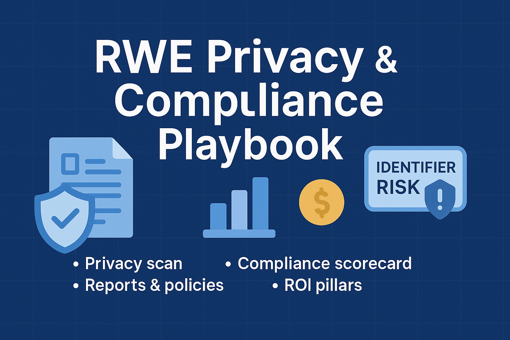

# 🔒 RWE Privacy & Compliance Playbook

**Automated checks and scorecards to evaluate Real-World Data (RWD/RWE) pipelines against privacy and regulatory requirements (HIPAA, GDPR, DUA).**



---

## 📖 Overview

This playbook extends the [RWE Governance & Analytics Playbook](https://github.com/camontefusco/RWE-governance-and-analytics-playbook-openFDA-clinicaltrials-CDC-OMOP-FHIR-ROI) by adding a **privacy & compliance lens**:

- Detect quasi-identifiers and re-identification risks  
- Evaluate datasets for **HIPAA Safe Harbor** and **GDPR anonymization** requirements  
- Score compliance risks across jurisdictions (US, EU, APAC)  
- Link governance metrics → compliance risk → business impact  

Built with Jupyter notebooks + helper scripts. Beginner-friendly outputs (CSVs, JSONs, PDFs) make it easy for leaders, data stewards, and compliance teams to understand and act.

---

## 🗂️ Repo Structure

```text
RWE-Privacy-and-Compliance-Playbook/
├── notebooks/
│ ├── 01_privacy_quasi_identifier_scan.ipynb # scan direct/quasi IDs, k/l, write privacy_report.json
│ ├── 02_deidentification_scorecard.ipynb # generalize data, compare before→after, write deidentification_scorecard.json
│ ├── 03_jurisdictional_compliance_matrix.ipynb # HIPAA/GDPR/DUA scoring, write privacy_compliance_report.json
│ └── 04_privacy_risk_to_roi.ipynb # ROI + sensitivity; builds the final PDF report
│
├── scripts/
│ ├── privacy_checks.py # identifier scan, k-anonymity, l-diversity, roles
│ ├── compliance_matrix.py # HIPAA Safe Harbor, GDPR risk, DUA score & index
│ ├── roi_privacy.py # avoided loss, time-to-market, NPV, sensitivity
│ └── report_builder.py # composes PDF/MD using results + embedded charts
│
├── visuals/
│ └── privacy_plots.py # identifier heatmap, k-hist, compliance bar, ROI waterfall, tornado
│
├── data/ # inputs & notebook outputs
│ ├── sample_synthetic.csv # quick demo dataset (safe to share)
│ ├── privacy_report.json # from 01
│ ├── deidentification_scorecard.json # from 02
│ ├── privacy_compliance_report.json # from 03
│ ├── privacy_roi_summary.json # from 04 (ROI)
│ └── privacy_sensitivity.json # from 04 (sensitivity rows)
│
├── reports/
│ ├── assets/ # charts embedded in the report
│ │ ├── identifier_map.png
│ │ ├── k_hist.png
│ │ ├── k_hist_before.png
│ │ ├── k_hist_after.png
│ │ ├── compliance_bar.png
│ │ ├── roi_waterfall.png
│ │ └── sensitivity_tornado.png
│ └── privacy_compliance_report.pdf # leadership-facing PDF (MD fallback if ReportLab unavailable)
│
├── README.md # quickstart, workflow, structure, usage
└── requirements.txt # pandas, numpy, matplotlib, (optional) reportlab
```
## 🚀 Quickstart

## 1. Clone & setup
```bash
git clone https://github.com/camontefusco/RWE-Privacy-and-Compliance-Playbook.git
cd RWE-Privacy-and-Compliance-Playbook
pip install -r requirements.txt
```
## 2. Run notebooks in order

**01_privacy_quasi_identifier_scan.ipynb**  
- Load your dataset (or defaults to `data/sample_synthetic.csv`)  
- Detect direct & quasi-identifiers  
- Compute k-anonymity / l-diversity  
- Save `data/privacy_report.json`  

**02_deidentification_scorecard.ipynb**  
- Apply simple generalizations (dates → year, ZIP → ZIP3, bucketing, drops)  
- Recompute metrics  
- Compare before → after  
- Save `data/deidentification_scorecard.json`  

**03_jurisdictional_compliance_matrix.ipynb**  
- Score HIPAA Safe Harbor, GDPR risk, DUA gates  
- Save `data/privacy_compliance_report.json`  
- Visualize readiness in `reports/assets/compliance_bar.png`  

**04_privacy_risk_to_roi.ipynb**  
- Translate compliance posture into ROI  
- Run sensitivity analysis  
- Auto-generate `reports/privacy_compliance_report.pdf`  

---

## 3. Outputs

- **CSVs/JSONs** → identifier scans, scorecards, compliance results → `data/`  
- **Visuals** → charts for identifiers, k-distribution, compliance → `reports/assets/`  
- **PDF Report** → leadership-facing summary → `reports/privacy_compliance_report.pdf`  

---

## 4. For beginners

- Start with the included `sample_synthetic.csv` to see everything run out-of-the-box.  
- Swap in your own extract by placing a CSV in `data/` and editing `DATA_FILE` in Notebook 01.  
- Each notebook saves its outputs automatically for the next one.  

---

## 📊 Privacy & Compliance Scorecard

| Metric            | Meaning                                               |
|-------------------|-------------------------------------------------------|
| Identifier risk   | % of columns containing direct or quasi-identifiers   |
| K-anonymity       | Minimum group size ensuring anonymity                 |
| L-diversity       | Diversity of sensitive attributes within groups       |
| HIPAA compliance  | Alignment with HIPAA Safe Harbor identifiers list     |
| GDPR compliance   | Risk-based anonymization readiness                    |

---

## 💰 ROI of Safeguards

Using `roi_privacy.py`, privacy safeguards are translated into business terms:

- **Cost avoided** → regulatory fines, trial delays, reputational loss  
- **Investment required** → de-ID pipelines, privacy-preserving analytics  
- **Net benefit** → readiness score uplift × trial/market value impact  

---

## 📑 Reports & Policies

- **`reports/privacy_compliance_report.pdf`** → beginner-friendly compliance report  
- **Privacy Checklist (md)** → template for data stewards  
- **Compliance Policy (md)** → organizational safeguards & roles  

---

## 🧭 Talking Points for Leadership

- **Proactive compliance** → cheaper than reactive penalties  
- **Interoperability with governance** → complements RWE scorecard from repo #1  
- **Risk-to-value translation** → links privacy safeguards to ROI  
- **Enablement** → empowers clinical, regulatory, HEOR teams to use compliant RWE  

---

## 📫 Contact

**Carlos Victor Montefusco Pereira, PhD**  
- [LinkedIn](https://www.linkedin.com/in/carlos-montefusco-pereira-dr/)  
